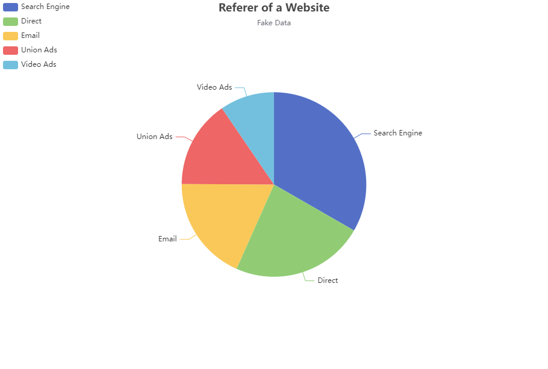
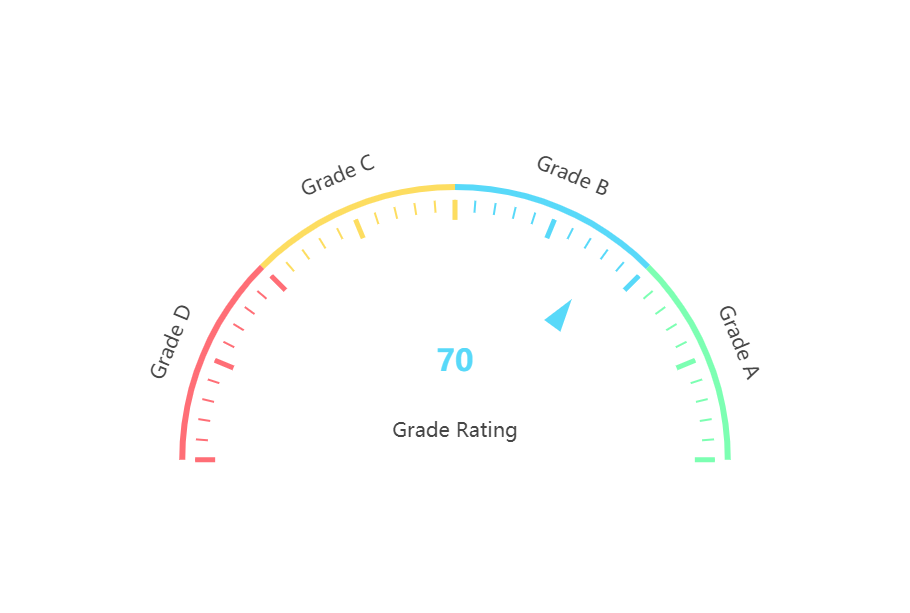

# Graph Possibilities - Voices That Count <!-- omit in toc -->
*by Hube Van Loey*

This document provides an overview of all the possibilities regarding graphs & data-visualisation. The examples given are based on the [Apache Echarts](https://echarts.apache.org/examples/en/index.html) and [Chart.js](https://www.chartjs.org/docs/latest/samples/information.html) library. I picked out the most common charts for each type, but naturally there are many more possibilities. Feel free to check out the library example pages of both libraries to discover more awesome charts!

## Table of Content <!-- omit in toc -->
- [1. Line Charts](#1-line-charts)
  - [1.1 Line Chart](#11-line-chart)
  - [1.2 Stacked Line Chart](#12-stacked-line-chart)
  - [1.3 Stepped Line Chart](#13-stepped-line-chart)
- [2. Bar Charts](#2-bar-charts)
  - [2.1 Bar Chart](#21-bar-chart)
  - [2.2 Multiple Bar Chart](#22-multiple-bar-chart)
- [3. Pie Charts](#3-pie-charts)
  - [3.1 Pie Chart](#31-pie-chart)
  - [3.2 Donut Chart](#32-donut-chart)
  - [3.3 Multiple Pie Chart](#33-multiple-pie-chart)
  - [3.4 Expanded Pie Chart](#34-expanded-pie-chart)
- [4. Scatter Plots](#4-scatter-plots)
  - [4.1 Scatter Plot](#41-scatter-plot)
  - [4.2 Clustered Scatter Plot](#42-clustered-scatter-plot)
  - [4.3 Nebula Scatter Plot](#43-nebula-scatter-plot)
- [5. Geomap Charts](#5-geomap-charts)
  - [5.1 Area Map Chart](#51-area-map-chart)
  - [5.2 Custom Map Chart](#52-custom-map-chart)
- [6. Candlestick Charts](#6-candlestick-charts)
  - [6.1 Candlestick Chart](#61-candlestick-chart)
- [7. Radar Charts](#7-radar-charts)
  - [7.1 radar Chart](#71-radar-chart)
- [8. Boxplot Charts](#8-boxplot-charts)
  - [8.1 Boxplot Chart](#81-boxplot-chart)
- [9. Heatmap Charts](#9-heatmap-charts)
  - [9.1 Heatmap Chart](#91-heatmap-chart)
  - [9.2 Cartesian Heatmap Chart](#92-cartesian-heatmap-chart)
- [10. Tree Charts](#10-tree-charts)
  - [10.1 Tree Split Chart](#101-tree-split-chart)
  - [10.2 Tree Box Chart](#102-tree-box-chart)
- [11. Rose/Sunburst Charts](#11-rosesunburst-charts)
  - [11.1 Sunburst Chart](#111-sunburst-chart)
- [12. Funnel Charts](#12-funnel-charts)
  - [12.1 Funnel Chart](#121-funnel-chart)
- [13. Gauge Charts](#13-gauge-charts)
  - [13.1 Gauge Chart](#131-gauge-chart)
- [14. Calendar Charts](#14-calendar-charts)
  - [14.1 Calendar Chart](#141-calendar-chart)
- [15. Others](#15-others)
  - [15.1 Fill Shape Chart](#151-fill-shape-chart)
  - [15.2 Velocity Chart](#152-velocity-chart)
  - [15.3 Geo Pinpoint Chart](#153-geo-pinpoint-chart)

  
## 1. Line Charts
### 1.1 Line Chart
A simple line chart is effective for showing trends over time. It can be used to illustrate changes in public opinions on specific topics or living environment factors over different periods.

### 1.2 Stacked Line Chart
Stacked Line Charts are useful for displaying multiple datasets, showing the contribution of each category to the total. This can be applied to visualize various aspects contributing to public opinions on different living environment factors.

### 1.3 Stepped Line Chart
Stepped Line Charts are beneficial when emphasizing changes at specific points in time. It can be applied to highlight significant events or policy changes affecting public opinions.

## 2. Bar Charts
### 2.1 Bar Chart
Bar charts are effective for comparing quantities across different categories. It can be used to compare public opinions on various living environment factors in a straightforward manner.

### 2.2 Multiple Bar Chart
Multiple Bar Charts are suitable for comparing multiple datasets side by side. This can be applied to analyze and compare public opinions on different topics across various demographics.

## 3. Pie Charts
### 3.1 Pie Chart
Pie charts are useful for showing the proportion of a whole. It can be applied to represent the distribution of opinions on specific living environment aspects within a given population.

### 3.2 Donut Chart
Donut charts are similar to pie charts but provide space in the center. It can be applied for the same purposes as pie charts, offering an aesthetically pleasing alternative.

### 3.3 Multiple Pie Chart
Multiple Pie Charts can be used to compare the distribution of opinions on different topics among various subgroups within the population.

### 3.4 Expanded Pie Chart
Expanded Pie Charts with rose type can visually emphasize differences in proportions. It can be applied to highlight specific aspects of public opinions.

## 4. Scatter Plots
### 4.1 Scatter Plot
Scatter Plots are effective for visualizing relationships between two variables. It can be applied to explore correlations between living environment factors and public opinions.

### 4.2 Clustered Scatter Plot
Clustered Scatter Plots are useful for identifying patterns and groups within the data. It can be applied to discover clusters of opinions on specific topics.

### 4.3 Nebula Scatter Plot
Nebula Scatter Plots add a visual dimension to scatter plots. It can be applied for a unique representation of the density and distribution of opinions.

## 5. Geomap Charts
### 5.1 Area Map Chart
Area Map Charts can be used to represent regional variations in public opinions on living environment factors, providing a geographic perspective.

### 5.2 Custom Map Chart
Custom Map Charts offer flexibility in displaying data on custom maps. It can be applied to visualize opinions on specific topics in custom geographical regions.

## 6. Candlestick Charts
### 6.1 Candlestick Chart
Candlestick Charts are commonly used in financial analysis but can be applied to represent fluctuations in public opinions over time, providing insights into the volatility of sentiments.

## 7. Radar Charts
### 7.1 radar Chart
Radar Charts are effective for displaying multivariate data. It can be applied to showcase the strengths and weaknesses of various factors influencing public opinions.

## 8. Boxplot Charts
### 8.1 Boxplot Chart
Boxplot Charts are useful for visualizing the distribution of data and identifying outliers. It can be applied to analyze the spread of opinions on specific topics.

## 9. Heatmap Charts
### 9.1 Heatmap Chart
Heatmap Charts are effective for representing the intensity of relationships between two variables. It can be applied to highlight patterns in public opinions on living environment factors.

### 9.2 Cartesian Heatmap Chart
Cartesian Heatmap Charts provide an alternative way to visualize the intensity of relationships. It can be applied to explore correlations between different factors influencing public opinions.

## 10. Tree Charts
### 10.1 Tree Split Chart
Tree Split Charts are useful for hierarchical data. It can be applied to represent the breakdown of opinions on specific topics within different subgroups.

### 10.2 Tree Box Chart
Tree Box Charts are effective for visualizing hierarchical structures. It can be applied to represent the hierarchy of factors influencing public opinions on living environment topics.

## 11. Rose/Sunburst Charts
### 11.1 Sunburst Chart
Sunburst Charts display hierarchical data with a radial layout. It can be applied to represent the hierarchy of factors contributing to public opinions on different topics.

## 12. Funnel Charts
### 12.1 Funnel Chart
Funnel Charts are useful for visualizing a process, showcasing the progression of public opinions or decision-making on specific topics.

## 13. Gauge Charts
### 13.1 Gauge Chart
Gauge Charts can be applied to represent the level or magnitude of a single variable, such as the overall satisfaction level regarding living environment conditions.

## 14. Calendar Charts
### 14.1 Calendar Chart
Calendar Charts are effective for displaying data over time, especially if there are patterns or trends in public opinions related to specific dates.

## 15. Others
### 15.1 Fill Shape Chart

### 15.2 Velocity Chart

### 15.3 Geo Pinpoint Chart

